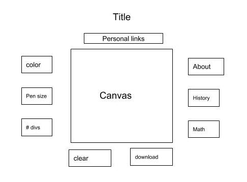

# MandalaMagic

## Background
Sanskrit for “circle”, mandalas are circlular symbols used as objects of devotion in Hindu and Buddhist practice. The construction of these symbols is extremely precise, with radial symmetry being of the utmost importance. This mandala generator allows for simple construction of the symbols by taking advantage of modern programming and radial symmetry. 
The generator works by dividing a circle into a set number of regions, with a drawing in any one of these regions being replicated in the rest, creating a patterned symmetrical circle.

## Functionality & MVP
 In this Mandala Magic Project users will be able to
* Choose the number of division on the circle
* Choose the pen width
* Choose the pen color
* Be able to remove division guides
* Be able to clear the board
* Be able to download the creation
In addition, the project will include
* An about Modal describing the origins of mandalas, and the mathematical principles behind them
* A production README

## Wireframes
The app will contain the canvas area where the user draws directly in the middle of the page. Above the canvas area there will be a title with personal links below. To the left will be the majority of user controls, while the clear and download controls are located below th canvas. The right will contain the history of mandalas and the mathematical concepts behind the app.

https://github.com/elibretti/MandalaMagic/blob/master/WireFrame/JS%20Project%20Proposal.jpg

## Architecture and Technologies
The project will be built with the following technologies:
* Javascript for logic
* CanvasJS for an interactive user drawing experience
* Webpack to bundle js files

The scripts involved in this project will include:
* app.js - the entry file
* canvas.js - the main canvas file is defined and 
* listeners.js- event listeners and their handler functions are defined 
* settings.js - user inputted fields are created and handled
* symmetry.js - calculations are figured out (canvas is passed as an argument)

## Implementation Timeline
### Day 1:
Set up files, webpack and necessary node modules, get a basic canvas drawing tool created this includes parts of canvas.js and listeners.js

### Day 2: 
Using hard coded settings, make sure symmetry.js is functioning perfectly and you are able to draw a mandala

### Day 3: 
Build out settings.js so that users can change the settings. Adapt the previous files so that these settings inputs alter their behavior

### Day 4: 
Style the css and create the “About” sections make sure everything looks perfect and the game is functioning without bugs

## Bonuses
* Create a Polygon Mode  where the mandala renders as a square not a circle
* Create a mirror mode which reflects the image in a section down the middle of each section

 
